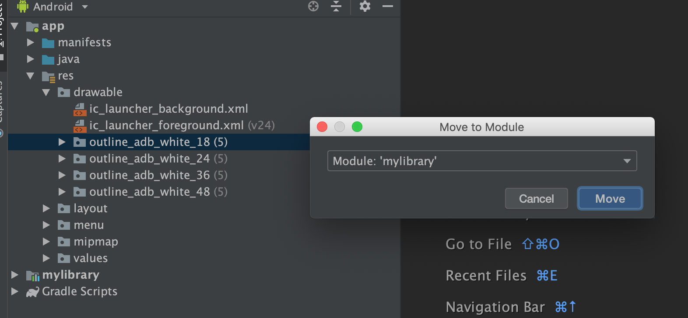

Move resources to module
===

A IntelliJ IDEA plugin that help you move Android resource files or directories to target module quickly.

It includes all the alternative resources when selecting only files.

**Install:** [Download latest release jar](https://github.com/abeade/move-to-module-plugin/releases) to disk for install.

**Usage:** Refactor → Move to Module...

**Keymap:** Control(Command) + Shift + X

**Example:** Select `outline_adb_white_18`, then batch move to `mylibrary`

---
Based in [Nongfu](https://github.com/mthli/Nongfu) plugin